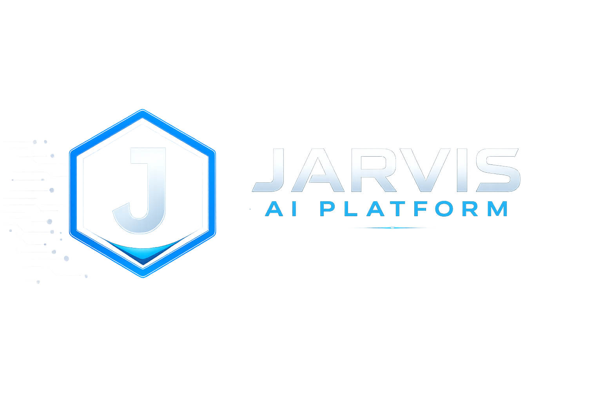
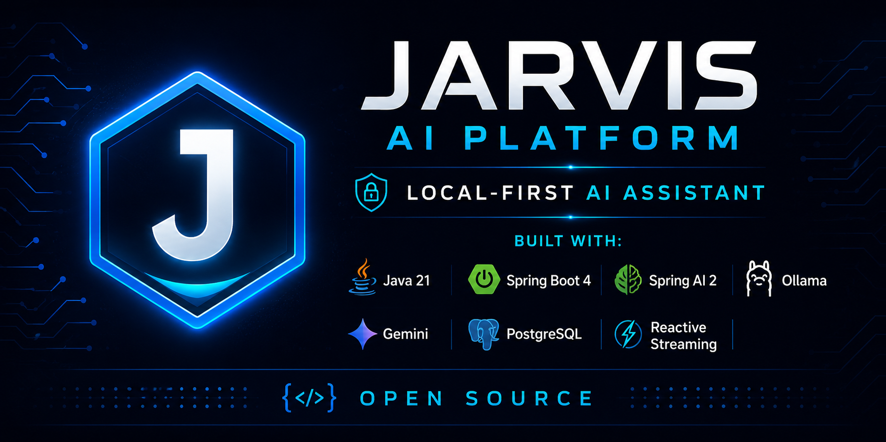

<div align="center">



#  Jarvis AI Platform

### **A Modular, Local-First, Open-Source AI Assistant Platform**

Built with **Java 21**, **Spring Boot 4**, and **Spring AI 2.0**

[](LICENSE)
[](https://adoptium.net/)
[](https://spring.io/projects/spring-boot)
[](https://spring.io/projects/spring-ai)
[](https://www.postgresql.org/)
[](https://github.com/pgvector/pgvector)
[](https://redis.io/)
[](https://github.com/sujankim/jarvis-ai-platform/releases)
[](https://github.com/sujankim/jarvis-ai-platform/actions)

</div>
---

## What Is Jarvis?

Jarvis is not just a chatbot. It is a **modular AI orchestration platform**
that runs entirely on your own machine.
Your AI. Your Data. Your Machine.

**Key differences from ChatGPT:**

* Your conversations **never leave your computer**
* Completely **free** (runs on Ollama locally)
* **Self-hosted** — you own everything
* **Remembers you** across sessions (Phase 2)

---
<p align="center">
  
</p>

---
<p align="center">
  
</p>

## Current Status

See **[ROADMAP.md](ROADMAP.md)** for the complete plan.

| Phase   | Version | Features            | Status         |
| ------- | ------- | ------------------- | -------------- |
| Phase 1 | v0.1.0  | AI Chat + CLI + JWT | ✅ Released     |
| Phase 2 | v0.2.0  | Memory System       | 🔨 In Progress |
| Phase 3 | v0.3.0  | RAG Engine          | 📋 Planned     |
| Phase 4 | v0.4.0  | Tool Engine         | 📋 Planned     |
| Phase 5 | v0.5.0  | Voice Assistant     | 📋 Planned     |
| Phase 6 | v0.6.0  | Agent System        | 📋 Planned     |
| Phase 7 | v1.0.0  | Web UI              | 📋 Planned     |

---

## What Works Right Now (v0.1.0)

| Feature                          | Status |
| -------------------------------- | ------ |
| AI chat via CLI (streaming)      | ✅      |
| JWT authentication (Argon2id)    | ✅      |
| Session management + persistence | ✅      |
| PostgreSQL (all messages saved)  | ✅      |
| Ollama local AI (primary)        | ✅      |
| Gemini cloud AI (fallback)       | ✅      |
| Provider abstraction layer       | ✅      |
| Working memory (date/time/user)  | ✅      |
| Redis session caching            | ✅      |
| pgvector semantic search (infra) | ✅      |
| Swagger UI                       | ✅      |
| Health monitoring                | ✅      |
| Spring Shell 4 CLI               | ✅      |

## What Is Being Built (Phase 2)

| Feature                       | Status         |
| ----------------------------- | -------------- |
| Long-term memory storage      | 🔨 In Progress |
| Memory extraction from chats  | 📋 Next        |
| Memory injection into prompts | 📋 Next        |
| Semantic memory search        | 📋 Next        |
| Conversation summarization    | 📋 Next        |
| CLI memory commands           | 📋 Next        |

---

## Quick Start

### Prerequisites

| Tool   | Version | Install                |
| ------ | ------- | ---------------------- |
| Java   | 21+     | https://adoptium.net   |
| Docker | Latest  | https://www.docker.com |
| Ollama | Latest  | https://ollama.ai      |

### Step 1 — Clone

```bash
git clone https://github.com/sujankim/jarvis-ai-platform.git
cd jarvis-ai-platform
```

### Step 2 — Pull AI Models (one time)

```bash
# Main chat model (~5GB)
ollama pull llama3.1:8b

# Embedding model for semantic memory (~274MB)
ollama pull nomic-embed-text
```

### Step 3 — Configure

```bash
cp .env.example .env
# Edit .env — set JARVIS_JWT_SECRET (min 32 chars)
```

### Step 4 — Start Infrastructure

```bash
# Builds custom PostgreSQL with pgvector
# Starts PostgreSQL + Redis
docker-compose up -d
```

### Step 5 — Run Jarvis

```bash
cd server
./mvnw spring-boot:run
```

### Step 6 — Use Jarvis

```text
+==============================================+
|       JARVIS AI PLATFORM v0.1.0              |
+==============================================+

jarvis:> setup
jarvis:> login
jarvis:> chat

You: Hello Jarvis!
Jarvis: Hello Dravin! How can I help?
```

## CLI Commands

```bash
# Authentication
login
logout
whoami
setup

# Chat
chat
ask -m "..."

# Sessions
session
new-session
switch-session

# System
status
doctor
jarvis-version
about
help
```

## Architecture

```text
Spring Shell CLI / REST API (Swagger)
              |
    Spring Boot 4 AI Engine
              |
    ┌─────────┴──────────┐
    │                    │
AiOrchestrator      Memory System
    │               (Phase 2)
    │
PromptAssembler + ProviderRouter
    |                    |
OllamaProvider    GeminiProvider
(primary)         (fallback)
    |
PostgreSQL + pgvector    Redis
(sessions, memories,
 embeddings)
```

## Tech Stack

| Layer        | Technology                |
| ------------ | ------------------------- |
| Language     | Java 21 (LTS)             |
| Framework    | Spring Boot 4.0.6         |
| AI Framework | Spring AI 2.0 (M8)        |
| Web          | Spring WebFlux (reactive) |
| Security     | Spring Security 7 + JWT   |
| Password     | Argon2id (Bouncy Castle)  |
| Database     | PostgreSQL 16 + pgvector  |
| DB Access    | R2DBC (reactive)          |
| Cache        | Redis 7                   |
| Migrations   | Flyway                    |
| Local AI     | Ollama (llama3.1:8b)      |
| Embeddings   | Ollama (nomic-embed-text) |
| Cloud AI     | Google Gemini (fallback)  |
| CLI          | Spring Shell 4.0 + JLine  |
| Mapping      | MapStruct 1.6             |
| API Docs     | SpringDoc OpenAPI 3       |

## Contributing

See **[CONTRIBUTING.md](CONTRIBUTING.md)** for how to help.

Good first issues are labeled on GitHub.

Current Phase 2 good first issues:

* Add memory list CLI command
* Add memory REST API endpoints
* Write unit tests for MemoryService

## Privacy

* No telemetry by default
* No cloud dependency (Ollama runs locally)
* Your conversations never leave your machine
* Self-hosted — we run nothing on our end

## License

Apache License 2.0 — see **[LICENSE](LICENSE)**

## Articles

- [Building a Local-First AI Assistant with Spring Boot 4 and Spring AI 2.0 — Dev.to](https://dev.to/sujankim/building-a-local-first-ai-assistant-with-spring-boot-4-and-spring-ai-20-6ci)

- [Same on Hashnode](https://jarvis-ai-platform.hashnode.dev/building-a-local-first-ai-assistant-with-spring-boot-4-and-spring-ai-2-0)

---

<div align="center">
Built by Sujan and the open source community

⭐ Star this repo if Jarvis helps you!
</div>